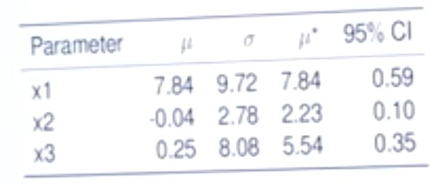

# SALib: Python Sensitivity Library

Will Usher  
UCL 2015.06.20

[youtube](https://www.youtube.com/watch?v=gkR_lz5OptU)  
[docs](https://salib.readthedocs.io/en/latest)  
[git](http://salib.github.io/SALib)

## 1. Why Sensitivity Analysis

"A fragile inference is not worth taking seriously."  Want robust inferences.
In·fer·ence (noun): a conclusion reached on the basis of evidence and reasoning.

Sensitivity Analysis Helps:

- corroborate (validate) model. Cor·rob·o·rate (tr.v.) To strengthen or support with other evidence; make more certain.
- test ability of model to parsimoniously explains world. Parsimonious (adj): Accounting for observed data with a relatively simple explanation.
- build confidence in results
- judge quality
- focus development - fit for purpose

### Sensitivity analysis: quantifies the degree to which a model input effects an output.

| Local Approaches | Global Approaches |
|---|---|
| e.g.: One at a time (OAT) approach   Excel spreadsheet on how interest rate affects an investment| e.g.: Sobol anaylsis   vary all the inputs at one any quantify effect of input space on output |
| low data requirements | need probabilistic data |
| quick and easy | computationally demanding |
| inputs: does not capture interactions | inputs: captures interactions |
| non-linear data: misleading | handles non-linear and non-additive |

### Benefits of Sensitivity Analysis

- **input factor prioritization**: which inputs are most important?
    + focus development
    + identify fragility
- **factor fixing**: which inputs can we safely ignore?
    + reduce dimensionality
    + identify redundancy (model and data)
    + simplify models (factors affect model structure)
- **factor mapping**: maps portion of output space onto inputs
    + threshold effects
    + uniqueness, instability, runaway
    + robustness

### Available Methods (Free)

### Global Approches

## 2. Real World Examples

- Time-varying effects of wathershed model (flood risk), John Herman 2013
    + FP 2: Sobol
    + FM + FP: Sobol, DMIM
- Large energy system optimization model Will Usher
    + FF + FP: - Morris

2 FP: factor prioritization, FF: factor fixing, FM: factor mapping

## 3. SALib

### Sensitivity Techniques

It is generally too computationally expensive to examine everything, so one or more of the following types of techniques are used.

| Type | Morris : DGSM | Sobol : FAST | Factorial | DMIM | Local SA |
|---|---|---|---|---|---|
| **sample source**| levels | distributions | levels | distributions | levels|
| ***k* inputs1**| 20-100 k | < 20 k | > 100 k | < 20 k | < 100 k
| **factor range**| global | global | global | global | local |
| **correlated**| no | no | yes | yes | no |
| **computational cost**| 10 (k + 1) | 500 (k + 2) | k -> 2k | 500 + 1 | 2(k+1) |
| **in SALib**| y | y | n | y | n |
| **setting2**| FF | FP, FF | FF | FM | FP |

1using groups of factors would allow larger numbers of factors to be explored  
2FP: factor prioritization, FF: factor fixing, FM: factor mapping

#### Install

    pip install SALib

or, using setuptools

    python setup.py install
    python setup.py test

or, fork github

    git clone http://salib.github.io/SALib)

### Local example

Should we install solar panels on roof?  
Simple spreadsheet model to workout the payback time.  
What are sources of incomes and costs?

inputs:  

- government subsidy / kW/hr
- solar irradiance / time: sunny year vs. less sunny year
- interest rate on money borrowed to invest in solar panels

output: net present value (NPV) built into Microsoft [Excel](https://hbr.org/2014/11/a-refresher-on-net-present-value):

- NPV > 0: invest
- NPV < 0=: do not invest

### Global Process

1. Define parameter file
2. Generate sample
3. Run the model
4. Compute the results metrics
5. View/evaluate results

### 1. Define parameter file

    parameter_dict = {'num_vars' : 3,
                      'names': ['x1', 'x2', 'x3],
                      'bounds': [[-3.14, 3.14],
                                 [-3.14, 3.14],
                                 [-3.14, 3.14],]}

Or save a parameter file: file.txt

    x1 -3.14 3.14
    x2 -3.14 3.14
    x3 -3.14 3.14

### 2. Generate sample

Python:

    model_input = SALib.sample.morris.sample(parameter_dict, 1000)

or, command line:

    python -m SALib.sample.morris -n 1000 -p parameter_file.txt -o model_input.txt

### 3. Run the model

Python:

    model_output = run_simulation(model_input)

or, command line:

    run_simulation -i model_input.txt -o model_output.txt

### 4. Compute the results metrics

Python:

    Si = morris.analyze(problem, model_input, model_output)

or, command line:

    python -m SALib.analyze.morris -p parameter_file.txt -Y model_output.txt -c 0 -X model_input.txt

### 5. View/evaluate results

- CI - how important
- &mu;* mean of variation of output given variation of each input,
- &sigma;: how much it interacts with other parameters OR is non-linear - standard deviation of &mu;*.

X1 is most important parmeter (CI), and interacts most with other paremeters (&sigma;).

## 4. Summary

Further readings: Saltelli, et. al. 2008 Global Sensitivity Analysis: Primer

- Feature importance?  These are simulation optimization model techniques.  There are similar bayesian techniques to calculate importance of priors.  Some might exist for machine learning.

- Scales reasonably well. Can group features and staged approach to reduce dimensionality.  You can then split important groups to find out what is important in group.  Can use fast method first then more computationally expensive methods later.

Adding sensitivity analysis to NPV analysis can help make robust multi-factor decisions: [video](https://www.youtube.com/watch?v=I-wzI3oJ79Y).
