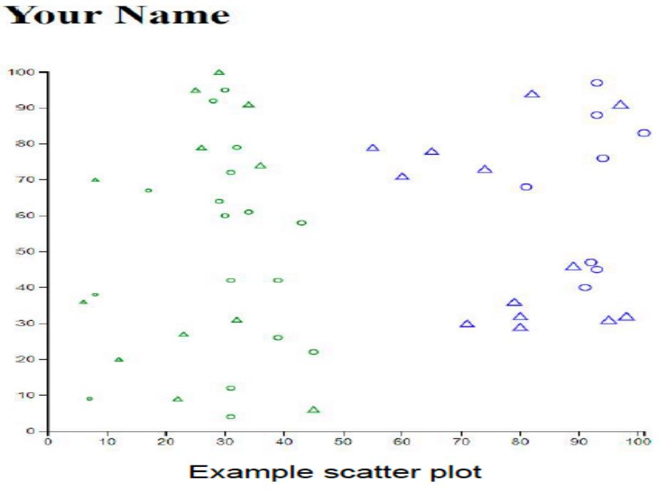

# Visual Analytics HW3-D3 

- Go through the D3 tutorial [alignedleft.com/tutorials/d3](http://alignedleft.com/tutorials/d3/) before attempting this question.
- Complete steps 01-16 (Complete through “16. Axes”).
- This is a simple and important tutorial which lays the groundwork for Homework 3.

Note: We recommend using Mozilla Firefox or Google Chrome, since they have relatively robust built-in developer tools. 

## Deliverables: Place all the files/folders listed below in a folder named [your name-hw3] and submit [your name-hw3].zip to CANVAS: 

- A folder named d3 containing file d3.v3.min.js downloaded from [https://d3js.org/d3.v3.min.js](https://d3js.org/d3.v3.min.js).
- index.html: When run in a browser, it should display a scatterplot with the following specifications.

### Specifications

a. [30 pt] Generate and plot 50 objects: 25 circles and 25 upward-pointing equilateral triangles.
Each object’s X and Y coordinates should be a random integer between 0 and 100 inclusively (i.e., [0, 100]).
An object’s X and Y coordinates should be independently computed.  
Each object’s size will be a value between 5 and 50 inclusively (i.e., [5, 50]). You should use the
“symbol.size()” function of d3 to adjust the size of the object. Use the object’s X coordinate to
determine the size of the object. You should use a linear scale for the size, to map the domain of X
values to the range of [5,50]. Objects with larger x coordinate values should have larger sizes.  
This link [github.com/d3/d3-3.x-api-reference/blob/master/SVG-Shapes.md#symbol_size](https://github.com/d3/d3-3.x-api-reference/blob/master/SVG-Shapes.md#symbol_size)
explains how size is interpreted by symbol.size().  
You may want to look at this example [bl.ocks.org/kiranml1/6972900](http://bl.ocks.org/kiranml1/6972900)  for the usage of “symbol.size()” function.
All objects with size greater than the average size of all scatterplot objects should be colored blue and all other objects
should be colored green. All these objects should not be filled (Please see the figure below).

b. [20 pt] The plot must have visible X and Y axes whose range of values linearly scale according to the
coordinates of the generated objects. The ticks on these axes should adjust automatically based on the
randomly generated scatterplot objects.

c. [10 pt] Your full name (in upper case) should appear above the scatterplot. Set the HTML title tag
(\<title\>) to your NAME.

#### Notes:

- We show an example result of how your scatter plot may look like in the above figure. Your plot will 
likely be different (e.g., different locations for the points).
- No external libraries should be used. The index.html file can only refer to d3.v3.min.js within the d3 
folder.

